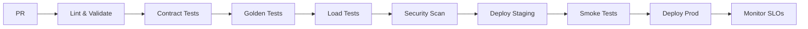

# API Framework Operating Standard

## Core Principles
- **Contract-first**: OpenAPI/AsyncAPI/GraphQL schemas drive code, tests, docs
- **Deterministic**: Identical inputs → identical outputs (including time scale, geodesy, ephemeris versions)
- **Observable**: OpenTelemetry traces/metrics/logs across REST, SSE, GraphQL
- **Modular**: Domains isolated via stable interfaces

## Non-Negotiable Guardrails

### Rules
- Ayanamsha/HouseSystem enums are closed; adding values is breaking unless gated behind new version
- SSE is canonical for streaming; GraphQL Subscriptions (if used) must mirror SSE semantics
- No long CPU work on request path; use queue (NATS/Kafka) for background jobs

### 1. API Surface Rules
| Type | Scope | Specification | Governance |
|------|-------|---------------|------------|
| REST | Public | OpenAPI 3.1 (authoritative) | Spectral lint, openapi-diff, Schemathesis fuzz |
| | | OpenAPI 3.0.3 (generated for SDKs) | Auto-generated from 3.1 source |
| SSE | Public | AsyncAPI 2.6 | Last-Event-ID resume, heartbeat interval, ordering guarantees, anti-buffer headers. Canonical for streaming. |
| Webhooks | Public | OpenAPI callbacks | HMAC-SHA256, replay protection, clock-skew window |
| gRPC | Internal only | Protobuf 3 | Service mesh, mTLS required |
| GraphQL | Internal & premium (persisted queries only) | Schema-first | Single graph initially, schema-diff gated, persisted queries, cost limits |
| Batch/Async | Background | Queue (NATS/Kafka) | No synchronous long-compute |

**Contract Honesty Rule**: Never accept fields in the API that aren't implemented. Remove or implement—no silent ignoring.

### 2. Domain Module Architecture
```
/spec                  # ALL contracts (single source of truth)
  /openapi.yaml        # REST API specification
  /asyncapi.yaml       # SSE/streaming specification
  /graphql/            # GraphQL schema + operations
  /VERSIONS.md         # Pinned ephemeris, ΔT, algo versions
/domains
  /ephemeris-core      # Pure calculations, no I/O
  /ephemeris-service   # Caching, batching, API
  /kp                  # KP techniques
  /horary              # Horary astrology
/shared
  /hooks               # Whitelisted extension points
  /telemetry           # Metrics, traces, logs
  /auth                # Authentication/authorization
```

**Rules:**
- Ephemeris is single source of truth
- Domains consume via `EphemerisQuery` interface only
- No direct SwissEph imports outside ephemeris-core
- Cross-cutting concerns in `/shared` are immutable

### 3. Caching & Determinism
**Cache key:** `sha256(normalized_inputs + normalization_version + algo_version + ephemeris_dataset_version + api_version)`

**Required Inputs (Astrology):**
- **Time**: UTC → TT conversion with pinned ΔT model (document in `/spec/VERSIONS.md`)
- **Location**: WGS84 lat/lon (6 decimal precision), altitude (meters)
- **Settings**: Ayanamsha (enum), node type, house system (enum)
- **Optional**: Pressure/temperature (refraction), names (hashed unless required)

**Normalization Module** (`/shared/normalize.py`):
- Time scale = UTC→TT with pinned ΔT model; WGS84 geodesy
- Include `normalization_version` and `ephemeris_dataset_version` in cache keys
- Coordinate precision rounding (1e-6°)
- Input validation and canonicalization
- Version stamping for cache keys

**Cache Tiers:**
- L1: In-process (per-request, 1s TTL for HFT)
- L2: Redis (no TTL, LRU eviction, max-memory limits, eviction telemetry)
- L3: Postgres/ClickHouse (materialized, AMD windows, time-series)
- Warm-rate SLO: ≥95% before version flip
- Response headers: `computed_from_cache: true|false`, `algo_version`

### 4. Version Migration
- **2 concurrent versions** max, **6-month overlap**
- **Release channels**: `stable` (pinned spec) and `next` (experimental); CI diff-gates `stable`
- Headers: `X-Algorithm-Version`, `Deprecation`, `Sunset`
- Golden corpus prewarming before version flip
- Breaking changes require new `/v{n}` endpoint

### 5. Governance Gates

#### Automated (CI/CD - Must Pass)
- [ ] OpenAPI validation (Spectral) + diff check
- [ ] AsyncAPI validation + diff check
- [ ] GraphQL schema validation + diff check (if applicable)
- [ ] Contract tests (Pact/Postman) + Schemathesis fuzz
- [ ] Golden determinism tests (including edge cases: leap seconds, polar coords)
- [ ] Performance regression (<10% tolerance)
- [ ] SSE semantics tests (ordering, resume, heartbeat)
- [ ] Observability checks (traces, metrics, resolver spans for GraphQL)
- [ ] Security scans (SAST, secrets)
- [ ] Ephemeris/ΔT version verification

#### Human Review
- [ ] Design review (CODEOWNERS approval)
- [ ] ADR for any exceptions
- [ ] Data residency compliance (US/EU)

## PR Checklist

```markdown
## API Change Checklist
- [ ] Contracts updated in `/spec` (OpenAPI/AsyncAPI/GraphQL)
- [ ] No breaking changes (or new version created)
- [ ] Contract diff checks passed (openapi-diff, asyncapi-diff, graphql-inspector)
- [ ] Schemathesis fuzz tests passed
- [ ] Golden test corpus updated (including edge cases)
- [ ] Cache key includes all varying inputs + version stamps
- [ ] SSE semantics tested (Last-Event-ID, ordering, heartbeat)
- [ ] GraphQL resolvers instrumented (if applicable)
- [ ] Metrics/traces instrumented
- [ ] Error responses follow RFC 7807
- [ ] Rate limits configured
- [ ] Documentation auto-generated
- [ ] ADR written if deviating from standard

## Determinism Verification
- [ ] SwissEph version unchanged (or bumped)
- [ ] ΔT model unchanged (or versioned)
- [ ] Normalization rules unchanged (or versioned)
- [ ] Enum values unchanged (or versioned)

## Performance
- [ ] p95 < 150ms (REST)
- [ ] SSE resume < 5s
- [ ] SSE KPIs: resume latency, stream lag, drop ratio, buffer occupancy
- [ ] Error rate < 0.1%
- [ ] Cache warm-rate > 95%
- [ ] Load tested with golden workload

## Security
- [ ] PII hashed/tokenized at edge
- [ ] Audit logging enabled
- [ ] CORS/CSP headers configured
- [ ] Input validation at edge
- [ ] GraphQL: persisted queries only (if public)
- [ ] Webhooks: HMAC-SHA256 + replay protection
```

## ADR Template

```markdown
# ADR-{number}: {title}

## Status
{Draft|Accepted|Rejected|Superseded}

## Context
What problem are we solving? Why can't we follow the standard?

## Decision
What are we doing differently? Be specific.

## Consequences
- **Positive:** What improves?
- **Negative:** What technical debt are we accepting?
- **Mitigation:** How do we limit blast radius?

## Alternatives Considered
What else did we evaluate? Why were they rejected?
```

## Extension Points

### Allowed Domain Hooks
```python
# /shared/hooks/interface.py
class DomainHook:
    def pre_request(self, ctx: RequestContext) -> None: pass
    def post_response(self, ctx: ResponseContext) -> None: pass
    def on_error(self, ctx: ErrorContext) -> None: pass
```

**Constraints:**
- No modification of auth, rate-limiting, telemetry
- 50ms timeout per hook
- Must be idempotent
- Version-pinned interface

## Security & Compliance

| Feature | Implementation | Location |
|---------|---------------|----------|
| PII Handling | Names hashed/tokenized at edge by default; raw only when technique requires; redacted in logs | Edge/Middleware |
| Rate Limits | API Gateway (Kong/Envoy) | Per API key |
| Feature Flags | LaunchDarkly/Unleash | Runtime evaluation |
| Version Pinning | `API-Version` header | Gateway routing |
| Quotas | Redis counters | Middleware |
| Data Residency | Region-aware routing | Load balancer |

## SLOs & Monitoring

**Key Metrics:**
- Availability: 99.9% (3 9s)
- p95 latency: ≤150ms
- Error rate: ≤0.1%
- Cache hit ratio: ≥80%

**Alerts:**
- SLO breach → PagerDuty
- Golden test failure → CI block
- Deprecation approaching → Team notification

## Deployment Pipeline



## GraphQL Implementation Guidelines

### Schema Requirements
- **Custom Scalars**: `DateTimeUTC`, `Latitude`, `Longitude` (enforce same normalization as REST)
- **DataLoader**: Mandatory for N+1 prevention, batch by time first
- **ChartSpec Interface**: Renderer-agnostic JSON (Vega-Lite/ECharts format)
- **Resolver Tracing**: Field-level spans with batch metrics

### Query Management
- Introspection off in prod; persisted queries only for any external use
- Query cost analysis and limits
- Single graph initially (federation only when services split)

## Implementation Priority Matrix

### P0 - Framework Critical (Week 1)
1. **Contract Migration**: Move to `/spec/openapi-3.1.yaml` as source of truth
2. **AsyncAPI Creation**: Document SSE contracts with resume/ordering tests
3. **Normalize Module**: Create `/shared/normalize.py` for UTC→TT, coordinate precision
4. **Content-Addressed Keys**: Implement everywhere with version stamps
5. **Contract Honesty**: Remove unimplemented fields from public API

### P1 - Scale & Observability (Week 2-3)
6. **OpenTelemetry**: Add tracing with resolver spans for future GraphQL
7. **L2/L3 Caching**: Redis (no TTL) + materialized tables
8. **Version Headers**: X-Algorithm-Version with warm-rate SLO
9. **GraphQL Foundation**: Single graph, DataLoader, ChartSpec interface

### P2 - Future Scale (Month 2)
10. **Queue Integration**: NATS/Kafka for batch jobs
11. **Precomputation**: Hot window materialization

---

**This standard is non-negotiable.** Exceptions require ADR + VP approval.